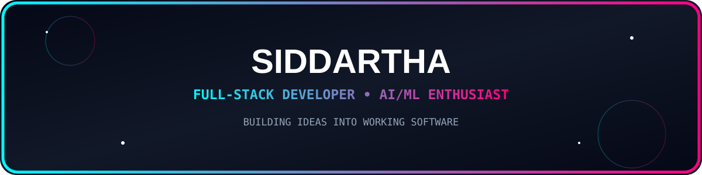
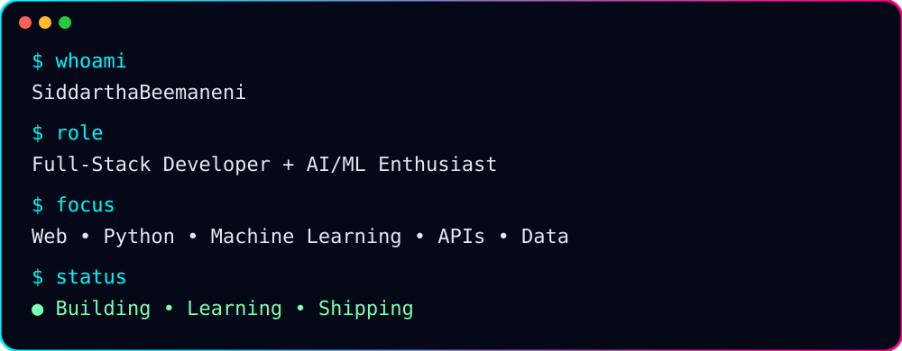

<div align="center">



<br/>


<br/><br/>

<a href="https://github.com/SiddarthaBeemaneni">

</a>
<a href="https://github.com/SiddarthaBeemaneni?tab=repositories">

</a>

</div>

---

<div align="center">

## ⚡ `whoami`



</div>

## 🧑‍💻 About Me

I'm **B. Venkata Siddartha**, a developer interested in building useful software across the **web, backend, data, and AI/ML**.

I enjoy taking a problem from an idea → implementation → working application.

```text
🌐 Web Development       →   Frontend + Backend + APIs
🐍 Python                →   Applications + Automation + Data
🤖 Machine Learning      →   Classification + Regression + Anomaly Detection
📊 Data                  →   NumPy + Pandas + Visualization
🧩 Problem Solving       →   DSA + Programming Practice
🚀 Product Building      →   Turning projects into usable applications
```

---

## 🧠 Tech Stack

<div align="center">


<br/><br/>


</div>

---

## 🚀 Featured Work

### 🎫 TicketSense — AI Helpdesk Ticket Classifier & Router

An AI-powered helpdesk application that classifies incoming support tickets and routes them using machine learning.

**Built with:** `Python` `Flask` `SQLite` `Scikit-learn` `TF-IDF` `Logistic Regression` `HTML` `CSS` `JavaScript`

**What it demonstrates:**
- 🤖 Machine-learning based classification
- 🎯 Ticket queue, priority and type prediction
- 📊 Dashboard and ticket management
- 🔐 Authentication
- 🔌 API-based backend
- 🗄️ Database integration
- ☁️ Deployment-ready Flask architecture

<div align="center">

<a href="https://github.com/SiddarthaBeemaneni/TicketSense-Helpdesk-Ticket-Classifier-Router">

</a>

</div>

---

### 📈 Student Performance Analysis & Prediction

A machine-learning project exploring student data, relationships between variables, and prediction of exam performance.

**Focus:** `Pandas` `NumPy` `Matplotlib` `Scikit-learn` `Regression` `EDA`

---

### 🚨 Server Resource Anomaly Predictor

A data/ML project focused on detecting unusual server-resource behavior from telemetry and engineered statistical features.

**Focus:** `Python` `Pandas` `Scikit-learn` `Random Forest` `Feature Engineering`

---

## 🛠️ What I Build

<div align="center">

| 🌐 Web | 🤖 AI / ML | 📊 Data | 🐍 Python |
|:---:|:---:|:---:|:---:|
| Frontend | Classification | EDA | Automation |
| Backend | Regression | Visualization | Applications |
| REST APIs | Anomaly Detection | Pandas | Problem Solving |
| Databases | Model Evaluation | NumPy | Scripting |

</div>

---

## 📊 GitHub Analytics

<div align="center">


<br/><br/>


</div>

---

## 🐍 Contribution Activity

<div align="center">


</div>

---

## 🔄 My Developer Journey

<div align="center">

```text
Python Fundamentals
        │
        ▼
Data Structures & Algorithms
        │
        ▼
NumPy + Pandas
        │
        ▼
Data Analysis + Visualization
        │
        ▼
Machine Learning
        │
        ▼
Flask + Backend Development
        │
        ▼
Full-Stack Applications
        │
        ▼
AI-Powered Web Applications
        │
        ▼
        🚀 NEXT: Production + Cloud + Advanced AI
```

</div>

---

## 🌱 Currently Exploring

```text
[████████████████████░░] Full-Stack Development
[██████████████████░░░░] Machine Learning
[█████████████████░░░░░] AI Applications
[███████████████░░░░░░░] Backend Architecture
[██████████████░░░░░░░░] Cloud & Deployment
[████████████████░░░░░░] Data Structures & Algorithms
```

---

## 🎯 2026 Goals

- 🚀 Build production-quality full-stack applications
- 🤖 Create practical AI-powered products
- 🧠 Level up DSA and problem solving
- ☁️ Learn deeper cloud and deployment workflows
- 🔧 Improve backend architecture and database design
- 🌍 Contribute to open-source projects
- 💡 Turn more ideas into shipped products

---

## 💬 Developer Mode

<div align="center">


### `BUILD → BREAK → LEARN → FIX → SHIP → REPEAT`

<br/>

<a href="https://github.com/SiddarthaBeemaneni?tab=repositories">

</a>

</div>
